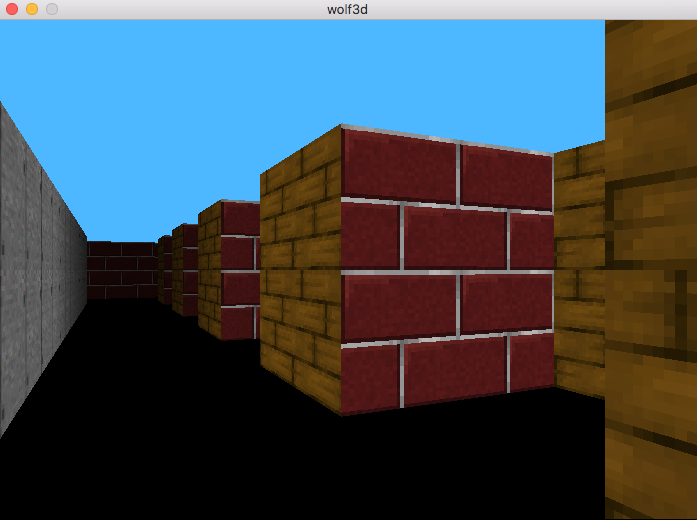

#							WOLF3D

il s'agit d'un projet graphic de l'ecole 42
Wolfenstein 3D est un jeu embématique du panthéon des jeux vidéos
il est réalisé en utilisant la librairie standart MINILIBX

# man d'utilisation
deplacement:                up down left right
changement de vitesse de deplacement:    + -:
changement de la hauteur des murs:    q w

